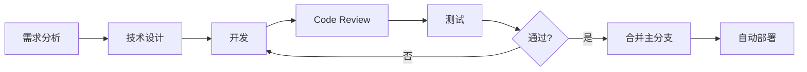

# OmniChain DeFi & Commerce Nexus - 开发计划（完整版）

| 属性 | 值 |
| :--- | :--- |
| **文档版本** | V1.0 |
| **创建日期** | 2025年10月17日 |
| **项目类型** | 跨链DeFi数据分析与可视化平台 |
| **预估周期** | 8-12周（完整版） / **2周（MVP版本）** |
| **状态** | ⚠️ 本文档为完整计划，实际采用 [2周MVP冲刺计划](./MVP_SPRINT_PLAN.md) |

---

## ⚡ 重要说明

> **本文档是完整的8-12周开发计划，用于长期规划和参考。**
> 
> **实际执行中，我们采用 [2周MVP冲刺计划](./MVP_SPRINT_PLAN.md)，聚焦核心功能快速交付。**
>
> MVP完成后，可以参考本文档进行功能扩展和优化。

---

## 📋 目录

1. [项目架构拆解](#1-项目架构拆解)
2. [技术栈详细规划](#2-技术栈详细规划)
3. [开发阶段与里程碑](#3-开发阶段与里程碑)
4. [任务拆解与优先级](#4-任务拆解与优先级)
5. [团队协作与分工](#5-团队协作与分工)
6. [风险评估与应对](#6-风险评估与应对)
7. [测试与部署策略](#7-测试与部署策略)

---

## 1. 项目架构拆解

### 1.1 系统架构概览

```
┌─────────────────────────────────────────────────────────────────┐
│                         前端展示层                               │
│  ┌──────────────────┐  ┌──────────────────┐  ┌──────────────┐  │
│  │  Dashboard UI    │  │  Alert Panel     │  │  Admin Panel │  │
│  │  (Blockscout SDK)│  │                  │  │              │  │
│  └──────────────────┘  └──────────────────┘  └──────────────┘  │
└────────────────────────────┬────────────────────────────────────┘
                             │
┌────────────────────────────┴────────────────────────────────────┐
│                        后端服务层                                │
│  ┌──────────────────┐  ┌──────────────────┐  ┌──────────────┐  │
│  │  GraphQL API     │  │  Alert Service   │  │  Price Oracle│  │
│  │  Gateway         │  │  (Notification)  │  │  Service     │  │
│  └──────────────────┘  └──────────────────┘  └──────────────┘  │
└────────────────────────────┬────────────────────────────────────┘
                             │
┌────────────────────────────┴────────────────────────────────────┐
│                        数据索引层                                │
│  ┌──────────────────┐  ┌──────────────────┐  ┌──────────────┐  │
│  │  Envio Indexer   │  │  Data Aggregator │  │  Cache Layer │  │
│  │  (GraphQL Output)│  │                  │  │  (Redis)     │  │
│  └──────────────────┘  └──────────────────┘  └──────────────┘  │
└────────────────────────────┬────────────────────────────────────┘
                             │
┌────────────────────────────┴────────────────────────────────────┐
│                        区块链数据源                              │
│  ┌─────────┐  ┌─────────┐  ┌─────────┐  ┌─────────┐           │
│  │ PYUSD   │  │ Hedera  │  │  Avail  │  │  Pyth   │           │
│  │ Contract│  │ HCS/HTS │  │  Nexus  │  │ Network │           │
│  └─────────┘  └─────────┘  └─────────┘  └─────────┘           │
└─────────────────────────────────────────────────────────────────┘
```

### 1.2 核心模块拆解

| 模块 ID | 模块名称 | 功能描述 | 技术栈 | 复杂度 |
| :--- | :--- | :--- | :--- | :--- |
| **M1** | 智能合约事件层 | 定义并部署发出关键事件的智能合约 | Solidity, Hardhat | 中 |
| **M2** | Envio数据索引器 | 索引链上事件并提供GraphQL API | Envio, TypeScript | 高 |
| **M3** | Pyth价格集成 | 实时获取PYUSD及其他资产价格 | Pyth SDK, Node.js | 低 |
| **M4** | 数据聚合服务 | 跨链数据整合与计算逻辑 | Node.js, GraphQL | 高 |
| **M5** | 预警系统 | 监控指标并触发通知 | Node.js, Discord/Telegram Bot | 中 |
| **M6** | Dashboard前端 | 数据可视化界面 | React, Blockscout SDK, Chart.js | 高 |
| **M7** | 缓存与优化层 | 提升查询性能 | Redis, PostgreSQL | 中 |
| **M8** | DevOps与监控 | 部署、日志和系统监控 | Docker, K8s, Grafana | 中 |

---

## 2. 技术栈详细规划

### 2.1 前端技术栈

```typescript
// 核心框架与库
{
  "framework": "React 18 + TypeScript",
  "ui-library": "Blockscout SDK Components + Tailwind CSS",
  "charts": "Recharts / Chart.js / D3.js",
  "state-management": "Zustand / Redux Toolkit",
  "data-fetching": "Apollo Client (GraphQL)",
  "routing": "React Router v6"
}
```

**关键依赖：**
- `@blockscout/sdk`: Blockscout组件库
- `@apollo/client`: GraphQL客户端
- `recharts`: 图表库
- `date-fns`: 时间处理
- `ethers.js`: 区块链交互

### 2.2 后端技术栈

```typescript
// API层
{
  "runtime": "Node.js 20+ / Bun",
  "framework": "Express / Fastify",
  "graphql": "Apollo Server / GraphQL Yoga",
  "orm": "Prisma / Drizzle ORM",
  "cache": "Redis",
  "queue": "BullMQ (后台任务)"
}
```

### 2.3 数据索引层

```yaml
# Envio配置
indexer:
  name: omnichain-defi-indexer
  networks:
    - ethereum-mainnet
    - hedera-mainnet
    - base
  contracts:
    - PYUSD Token
    - HTS Escrow
    - Avail Nexus Bridge
  output: PostgreSQL + GraphQL API
```

### 2.4 基础设施

| 组件 | 技术选型 | 用途 |
| :--- | :--- | :--- |
| **数据库** | PostgreSQL 15+ | Envio索引数据存储 |
| **缓存** | Redis 7+ | 高频查询缓存 |
| **消息队列** | BullMQ / RabbitMQ | 异步任务处理 |
| **容器化** | Docker + Docker Compose | 本地开发与部署 |
| **编排** | Kubernetes (可选) | 生产环境部署 |
| **监控** | Grafana + Prometheus | 系统监控 |
| **日志** | Loki / ELK Stack | 集中式日志管理 |

---

## 3. 开发阶段与里程碑

### 阶段一：基础设施搭建（Week 1-2）

**目标：** 完成开发环境配置和核心智能合约部署

| 任务 ID | 任务描述 | 交付物 | 负责人 | 时间 |
| :--- | :--- | :--- | :--- | :--- |
| T1.1 | 初始化项目结构（Monorepo） | `package.json`, `pnpm-workspace.yaml` | Full Stack | 1天 |
| T1.2 | 配置Hardhat开发环境 | `hardhat.config.ts` | Smart Contract | 1天 |
| T1.3 | 编写核心智能合约（PYUSD, Escrow） | Solidity合约 + 测试 | Smart Contract | 3天 |
| T1.4 | 部署测试网合约并发出事件 | 合约地址 + ABI | Smart Contract | 2天 |
| T1.5 | 配置Envio初始环境 | `envio.config.yaml` | Backend | 2天 |

**验收标准：**
- ✅ 所有智能合约通过单元测试（覆盖率 > 90%）
- ✅ 测试网合约成功部署并能触发事件
- ✅ Envio配置文件验证通过

---

### 阶段二：数据索引层开发（Week 3-4）

**目标：** 完成Envio Indexer配置并建立GraphQL API

| 任务 ID | 任务描述 | 交付物 | 负责人 | 时间 |
| :--- | :--- | :--- | :--- | :--- |
| T2.1 | 定义Envio索引事件列表 | Event Schema文档 | Backend | 1天 |
| T2.2 | 编写Envio事件处理器 | Handler Functions | Backend | 4天 |
| T2.3 | 配置PostgreSQL数据模型 | Database Schema | Backend | 2天 |
| T2.4 | 部署Envio Indexer到测试环境 | 运行中的Indexer服务 | DevOps | 2天 |
| T2.5 | 编写GraphQL查询示例 | Query文档 + Playground | Backend | 2天 |

**关键事件索引清单：**
```typescript
// PYUSD合约
- Transfer(from, to, amount)

// HTS Escrow合约
- AssetLocked(tradeId, asset, amount, timestamp)
- AssetReleased(tradeId, recipient, amount, timestamp)
- AssetRefunded(tradeId, sender, amount, timestamp)

// Hedera HCS (Agent协议)
- AgentDeployed(agentId, terms, timestamp)
- NegotiationComplete(agentId, success, duration)

// Avail Nexus
- BridgeExecuted(txHash, fromChain, toChain, amount)
- SwapCompleted(txHash, route, cost, timestamp)
```

**验收标准：**
- ✅ Indexer成功索引过去10,000+区块
- ✅ GraphQL查询响应时间 < 100ms
- ✅ 数据完整性测试通过

---

### 阶段三：价格服务与数据聚合（Week 4-5）

**目标：** 集成Pyth Network并构建数据聚合层

| 任务 ID | 任务描述 | 交付物 | 负责人 | 时间 |
| :--- | :--- | :--- | :--- | :--- |
| T3.1 | 集成Pyth Network SDK | Price Service API | Backend | 2天 |
| T3.2 | 实现价格缓存机制（5秒更新） | Redis缓存逻辑 | Backend | 2天 |
| T3.3 | 开发数据聚合服务 | Aggregator Service | Backend | 3天 |
| T3.4 | 实现USD价值计算逻辑 | 计算函数 + 单元测试 | Backend | 2天 |

**核心计算指标实现：**
```typescript
// 需要实现的计算函数
- calculateTotalTreasuryValue()
- calculateAPY()
- calculateAgentSuccessRate()
- calculateAverageNegotiationTime()
- calculateCrossChainVolume()
- calculateRouteCosts()
```

**验收标准：**
- ✅ Pyth价格数据延迟 ≤ 5秒
- ✅ 所有USD计价指标准确无误
- ✅ 缓存命中率 > 80%

---

### 阶段四：预警系统开发（Week 5-6）

**目标：** 实现自定义预警和通知系统

| 任务 ID | 任务描述 | 交付物 | 负责人 | 时间 |
| :--- | :--- | :--- | :--- | :--- |
| T4.1 | 设计Alert规则引擎 | 规则定义系统 | Backend | 2天 |
| T4.2 | 实现定时监控任务（BullMQ） | Job Scheduler | Backend | 2天 |
| T4.3 | 集成Discord/Telegram Bot | 通知服务 | Backend | 3天 |
| T4.4 | 实现三种核心警报类型 | Alert Handlers | Backend | 2天 |

**MVP警报规则：**
```typescript
// Alert Rule Definitions
const alertRules = [
  {
    id: 'treasury-yield-low',
    condition: 'APY < 4% for 1 hour',
    channel: 'discord',
    severity: 'high'
  },
  {
    id: 'large-transaction',
    condition: 'Single TX > $100,000',
    channel: 'telegram',
    severity: 'medium'
  },
  {
    id: 'indexer-health',
    condition: 'No new blocks for 10 minutes',
    channel: 'discord',
    severity: 'critical'
  }
];
```

**验收标准：**
- ✅ 警报触发延迟 < 30秒
- ✅ 通知成功率 > 99%
- ✅ 无误报（False Positive < 1%）

---

### 阶段五：Dashboard前端开发（Week 6-9）

**目标：** 构建完整的数据可视化界面

| 任务 ID | 任务描述 | 交付物 | 负责人 | 时间 |
| :--- | :--- | :--- | :--- | :--- |
| T5.1 | 搭建React项目框架 | 项目骨架 | Frontend | 2天 |
| T5.2 | 集成Blockscout SDK组件 | UI组件库 | Frontend | 2天 |
| T5.3 | 开发DAO财政健康仪表板 | Dashboard页面 | Frontend | 5天 |
| T5.4 | 开发商业与交易分析仪表板 | Dashboard页面 | Frontend | 5天 |
| T5.5 | 实现时间范围选择器 | 时间过滤组件 | Frontend | 2天 |
| T5.6 | 性能优化（加载时间 < 3秒） | 优化报告 | Frontend | 3天 |

**前端页面结构：**
```
/dashboard
  ├── /treasury          # DAO财政健康仪表板
  │   ├── TotalValue     # 总资产价值卡片
  │   ├── FlowChart      # 资产流动图
  │   ├── YieldChart     # Yield表现曲线
  │   └── TopFarms       # 高收益推荐
  ├── /commerce          # 商业与交易分析
  │   ├── VolumeChart    # 跨链交易量
  │   ├── SuccessRate    # Agent成功率饼图
  │   ├── NegotiationTime # 平均谈判时间
  │   └── RouteAnalysis  # 跨链路径分析
  └── /alerts            # 警报管理面板
      ├── ActiveAlerts   # 活跃警报列表
      └── AlertHistory   # 历史警报
```

**关键组件列表：**
```typescript
// 组件开发清单
1. TreasuryValueCard      - 总资产价值展示
2. AssetFlowChart         - 资产流动折线图
3. YieldPerformanceChart  - APY曲线图
4. TopYieldFarmsCard      - 高收益推荐卡片
5. CrossChainVolumeChart  - 交易量柱状图
6. AgentSuccessRatePie    - 成功率饼图
7. NegotiationTimeCard    - 平均时间指标
8. RouteAnalysisTable     - 路径分析表格
9. TimeRangeSelector      - 时间选择器
10. AlertPanel            - 警报面板
```

**验收标准：**
- ✅ 首屏加载时间 ≤ 3秒
- ✅ 所有图表数据正确渲染
- ✅ 响应式设计（支持移动端）
- ✅ 通过Lighthouse性能测试 (>90分)

---

### 阶段六：集成测试与优化（Week 9-10）

**目标：** 端到端测试和性能优化

| 任务 ID | 任务描述 | 交付物 | 负责人 | 时间 |
| :--- | :--- | :--- | :--- | :--- |
| T6.1 | E2E测试套件编写 | Cypress/Playwright测试 | QA | 3天 |
| T6.2 | 负载测试（GraphQL API） | 性能测试报告 | Backend | 2天 |
| T6.3 | 数据准确性验证 | 验证脚本 + 报告 | Full Stack | 2天 |
| T6.4 | UI/UX优化 | 优化清单 | Frontend | 2天 |
| T6.5 | 安全审计（API访问控制） | 安全报告 | Backend | 2天 |

**测试覆盖目标：**
- 单元测试：> 85%
- 集成测试：> 70%
- E2E测试：核心用户流程100%

---

### 阶段七：部署与上线（Week 11-12）

**目标：** 生产环境部署和监控配置

| 任务 ID | 任务描述 | 交付物 | 负责人 | 时间 |
| :--- | :--- | :--- | :--- | :--- |
| T7.1 | 配置生产环境基础设施 | Infra as Code | DevOps | 3天 |
| T7.2 | 部署Envio Indexer主网 | 运行中的服务 | DevOps | 2天 |
| T7.3 | 部署后端API服务 | API端点 | DevOps | 2天 |
| T7.4 | 部署前端应用（CDN） | 生产环境URL | DevOps | 1天 |
| T7.5 | 配置Grafana监控大盘 | 监控面板 | DevOps | 2天 |
| T7.6 | 编写运维文档 | 运维手册 | DevOps | 2天 |

**部署检查清单：**
```yaml
# 生产环境Checklist
infrastructure:
  - [ ] PostgreSQL集群配置（主从复制）
  - [ ] Redis集群配置（持久化）
  - [ ] Load Balancer配置
  - [ ] CDN配置（前端静态资源）
  - [ ] HTTPS证书配置

monitoring:
  - [ ] Prometheus指标采集
  - [ ] Grafana Dashboard配置
  - [ ] 错误日志告警
  - [ ] 性能指标监控
  - [ ] 数据库慢查询监控

security:
  - [ ] API Rate Limiting
  - [ ] CORS配置
  - [ ] 环境变量安全存储
  - [ ] 数据库访问控制
  - [ ] DDoS防护
```

---

## 4. 任务拆解与优先级

### 4.1 关键路径任务（P0 - 必须完成）

| 优先级 | 任务组 | 任务描述 | 依赖 | 预估工时 |
| :--- | :--- | :--- | :--- | :--- |
| **P0** | 智能合约 | 编写并部署核心事件合约 | 无 | 40h |
| **P0** | Envio Indexer | 配置并部署数据索引器 | 智能合约 | 60h |
| **P0** | GraphQL API | 实现核心查询接口 | Envio | 40h |
| **P0** | Pyth集成 | 实时价格数据集成 | 无 | 20h |
| **P0** | 财政Dashboard | DAO财政健康仪表板 | GraphQL API | 50h |
| **P0** | 交易Dashboard | 商业与交易分析仪表板 | GraphQL API | 50h |

### 4.2 重要任务（P1 - 应该完成）

| 优先级 | 任务组 | 任务描述 | 依赖 | 预估工时 |
| :--- | :--- | :--- | :--- | :--- |
| **P1** | 预警系统 | 实现三种核心警报 | GraphQL API | 40h |
| **P1** | 数据聚合 | 跨链数据整合逻辑 | Envio | 30h |
| **P1** | 缓存层 | Redis缓存优化 | GraphQL API | 20h |
| **P1** | 测试套件 | E2E与集成测试 | 所有功能 | 40h |

### 4.3 可选任务（P2 - 可以推迟）

| 优先级 | 任务组 | 任务描述 | 依赖 | 预估工时 |
| :--- | :--- | :--- | :--- | :--- |
| **P2** | Admin Panel | 管理后台界面 | 后端API | 30h |
| **P2** | 高级分析 | 自定义报表功能 | Dashboard | 40h |
| **P2** | Mobile App | 移动端原生应用 | API | 100h |
| **P2** | AI预测 | 基于历史数据的预测模型 | 数据积累 | 80h |

---

## 5. 团队协作与分工

### 5.1 推荐团队结构

| 角色 | 职责 | 技能要求 | 人数 |
| :--- | :--- | :--- | :--- |
| **Smart Contract Engineer** | 智能合约开发与测试 | Solidity, Hardhat, Security | 1 |
| **Backend Engineer** | Envio配置、API开发、预警系统 | Node.js, GraphQL, PostgreSQL | 2 |
| **Frontend Engineer** | Dashboard开发、UI/UX实现 | React, TypeScript, Charts | 2 |
| **DevOps Engineer** | 基础设施、部署、监控 | Docker, K8s, Cloud | 1 |
| **QA Engineer** | 测试、质量保证 | Testing Frameworks | 1 |
| **Product Manager** | 需求管理、进度协调 | Agile, Communication | 1 |

### 5.2 协作工具建议

```yaml
项目管理: GitHub Projects / Linear / Jira
代码托管: GitHub / GitLab
文档协作: Notion / Confluence
即时通讯: Discord / Slack
设计协作: Figma
CI/CD: GitHub Actions / GitLab CI
```

### 5.3 开发流程



---

## 6. 风险评估与应对

### 6.1 技术风险

| 风险 | 影响 | 概率 | 应对策略 |
| :--- | :--- | :--- | :--- |
| **Envio索引延迟** | 高 | 中 | 1. 设置多个Indexer实例<br>2. 实现降级方案（直接RPC查询） |
| **GraphQL性能瓶颈** | 高 | 中 | 1. 实现多层缓存策略<br>2. 查询分页与限流<br>3. Database索引优化 |
| **链上数据不一致** | 高 | 低 | 1. 实现数据对账机制<br>2. 多数据源交叉验证 |
| **Pyth价格服务宕机** | 中 | 低 | 1. 配置多个价格源（Chainlink备份）<br>2. 本地价格缓存 |
| **跨链数据同步问题** | 中 | 中 | 1. 实现事务日志追踪<br>2. 手动对账工具 |

### 6.2 项目风险

| 风险 | 影响 | 概率 | 应对策略 |
| :--- | :--- | :--- | :--- |
| **需求变更** | 中 | 高 | 1. 采用敏捷开发<br>2. 每周需求评审 |
| **人员变动** | 高 | 中 | 1. 完善文档<br>2. 代码规范与注释<br>3. 知识分享会 |
| **第三方依赖问题** | 中 | 中 | 1. 锁定依赖版本<br>2. 评估替代方案 |
| **进度延期** | 中 | 中 | 1. 缩减P2功能<br>2. 增加资源 |

---

## 7. 测试与部署策略

### 7.1 测试策略

```typescript
// 测试金字塔
{
  "单元测试 (60%)": {
    "工具": "Vitest / Jest",
    "覆盖": "业务逻辑、工具函数、组件"
  },
  "集成测试 (30%)": {
    "工具": "Supertest (API) / Testing Library (UI)",
    "覆盖": "API端点、数据库交互、组件交互"
  },
  "E2E测试 (10%)": {
    "工具": "Playwright / Cypress",
    "覆盖": "核心用户流程"
  }
}
```

**关键测试场景：**
1. ✅ 用户访问Dashboard并查看实时数据
2. ✅ 警报触发并成功发送通知
3. ✅ 价格更新后USD计价自动更新
4. ✅ 历史数据查询准确性验证
5. ✅ 并发查询性能测试

### 7.2 部署策略

```yaml
# 多环境部署
environments:
  development:
    branch: develop
    auto-deploy: true
    database: dev-postgres
    
  staging:
    branch: staging
    auto-deploy: true
    database: staging-postgres
    
  production:
    branch: main
    auto-deploy: false  # 手动审批
    database: prod-postgres-cluster
```

**部署流程：**
```bash
# 1. 本地开发
git checkout -b feature/xxx
# 开发 -> 提交 -> Push

# 2. Pull Request
# Code Review -> CI自动测试 -> 合并到develop

# 3. Staging部署
git checkout staging
git merge develop
# 自动触发部署到Staging环境

# 4. 生产部署（手动）
git checkout main
git merge staging
git tag v1.0.0
# 手动触发生产部署
```

### 7.3 监控指标

**系统健康指标：**
```yaml
performance:
  - GraphQL API响应时间 < 100ms (P95)
  - Dashboard加载时间 < 3秒
  - Envio索引延迟 < 10秒
  
reliability:
  - API可用性 > 99.9%
  - 数据准确率 > 99.99%
  - 警报成功率 > 99%
  
resource:
  - CPU使用率 < 70%
  - 内存使用率 < 80%
  - 数据库连接数 < 80%
```

---

## 8. 交付清单 (Deliverables Checklist)

### 8.1 代码交付物

- [ ] **智能合约**
  - [ ] PYUSD Token合约（或使用现有）
  - [ ] HTS Escrow合约
  - [ ] 测试套件（覆盖率 > 90%）
  - [ ] 部署脚本

- [ ] **后端服务**
  - [ ] Envio Indexer配置
  - [ ] GraphQL API Gateway
  - [ ] 价格服务（Pyth集成）
  - [ ] 预警服务
  - [ ] 数据聚合服务

- [ ] **前端应用**
  - [ ] DAO财政健康Dashboard
  - [ ] 商业与交易分析Dashboard
  - [ ] 警报管理面板
  - [ ] 响应式设计

- [ ] **基础设施代码**
  - [ ] Docker Compose配置
  - [ ] Kubernetes配置（可选）
  - [ ] CI/CD Pipeline
  - [ ] 监控配置（Grafana）

### 8.2 文档交付物

- [ ] **技术文档**
  - [ ] 系统架构设计文档
  - [ ] API文档（GraphQL Schema）
  - [ ] 数据库Schema文档
  - [ ] 部署指南

- [ ] **运维文档**
  - [ ] 运维手册
  - [ ] 故障排查指南
  - [ ] 监控告警配置
  - [ ] 备份与恢复流程

- [ ] **用户文档**
  - [ ] Dashboard使用指南
  - [ ] 警报配置说明
  - [ ] FAQ文档

---

## 9. 成功标准 (Success Criteria)

### 9.1 功能标准

- ✅ 所有PRD定义的功能100%实现
- ✅ 三个核心Dashboard正常运行
- ✅ 三种警报类型正常触发
- ✅ 支持至少3条链的数据索引

### 9.2 性能标准

- ✅ Dashboard首屏加载 ≤ 3秒
- ✅ GraphQL关键查询 ≤ 100ms
- ✅ Pyth价格延迟 ≤ 5秒
- ✅ 警报触发延迟 ≤ 30秒

### 9.3 质量标准

- ✅ 代码测试覆盖率 > 80%
- ✅ 零严重级别Bug
- ✅ 数据准确率 > 99.99%
- ✅ 系统可用性 > 99.5%

### 9.4 用户标准

- ✅ 用户满意度评分 > 4.0/5.0
- ✅ Dashboard日活用户 > 50人
- ✅ 平均停留时间 > 5分钟

---

## 10. 下一步行动 (Next Steps)

### 立即开始（本周）：

1. ✅ **确认技术栈** - 与团队对齐所有技术选型
2. ✅ **初始化代码仓库** - 创建Monorepo结构
3. ✅ **搭建开发环境** - Docker Compose本地环境
4. ✅ **开始Sprint 1** - 智能合约开发

### 第一个Sprint（Week 1-2）关键任务：

```bash
# Sprint 1 Backlog
1. [ ] 创建项目Monorepo (packages/contracts, packages/indexer, packages/api, packages/frontend)
2. [ ] 配置Hardhat并编写PYUSD Transfer事件监听合约
3. [ ] 部署合约到测试网（Sepolia / Hedera Testnet）
4. [ ] 初始化Envio项目并配置第一个事件索引器
5. [ ] 编写第一个GraphQL查询（获取最新10笔PYUSD转账）
```

---

## 📞 联系与支持

如有任何问题或需要调整计划，请随时联系：

- **技术负责人**：[您的联系方式]
- **项目文档**：[Notion/Confluence链接]
- **代码仓库**：[GitHub链接]

---

**文档状态：** ✅ 已完成
**最后更新：** 2025年10月17日
**批准人：** [待填写]

